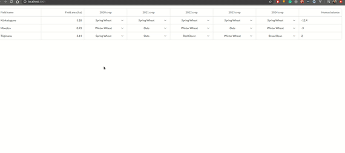

# Crop Planner Simulator Task

This project hosts the solution for eAgronom's Frontend Challenge :)

In it I will describe the process of how I decided to solve the problem, the technologies that I used and also the PRs and Testing.

I have pushed only one PR since it was only one feature to develop in the project.

However in common scenario I would develop a certain chunk of the feature in a separate PR so it is easier to whoever reviews it and also helps in case we need to revert any change.

# Demo

## Objective:

# How did I decide to tackle the problem?

The first thing was to read the problem and to see the technologies being used and requirements.

It was a lot of fun working with Ruby again since I have been mostly working with Node.js and Django in the backend.

Once I have read this the next task was to divide it in subtasks for the frontend and backend.

## Backend

- Route creation: Calculate hummus balance
- Service creation: Creation of the service to calculate hummus balance
- Controller creation: Creation of the controller to manipulate the hummus balance

## Frontend

- Connection with the backend to fetch hummus balance and update it
  Modified componentDidMount to fetch data in the backend
- Display hummus balance in the UI
- Display feedback for the farmer to see improvements and decreases

# Pull Request

The feature was developed in a sepearte pull request with the commits associated to it. This is a common practice I follow, afterwards someone reviews my PR or do a Pair Programming exercise to ensure the quality and coding standards of the feature being developed.

You may switch to the PR at anytime in which I divided it in the backend and frontend tasks poitned out before.

## Who reviewed my PR's ?

My friend's dog was in charge with the mission of reviewing my PRs in exchange for food.

# Big Thank You

It was a lot of fun working in this project! I am currently learning Estonian and translating them from English to Estonian was rather fun to me.

Along with this I loved working with Ruby and React :) and learned a bit more about a new area that interests me

# Initial description of the project

# Crop Planner Simulator

Farmer Fred is in trouble! For the last five years, he has been getting less and less corn from his fields and is
barley making ends meet. He thinks it’s because his soil quality is rapidly declining but why?

Perhaps you can help him find out! We’re sending you his fields and crops plan, but we are missing a critical piece of
information - the humus balance. Humus balance is a great metric of general soil health - the more humus the better!

Please implement the humus balance calculator so Mr. Fred could start fixing his soil for the future.

## The Task!

### Show a planned humus balance for each field

Your task is to implement a simulation of how different crops might affect the field's health.
Since the calculations in real life will be very complicated, the data should be calculated
in the server and results fetched to the front-end.

How to calculate humus balance based on our data?

- Each crop has a `humus_delta` showing how it affects the field.
- Add up all the `humus_delta`s of the field's crops over the years.
- For each consecutive year the crop is on the field, multiply its effects by 1.3

#### Requirements

- Calculator is implemented in the back-end
- Humus balance is fetched at page load for all fields
- Humus balance is fetched at every crop change
- Tests pass
- No page reloads (crop changes will be lost since we're using hardcoded data in the server)
- The farmer should get visual feedback about whether he is improving or degrading his fields

## Setting up

### Dependencies

- Ruby 3.0.0
- Yarn

### Back-end: Soil Service

- CD into the `soil-service` directory
- Run `bundle install`
- Make sure port `3000` is available on your machine
- Run `bundle exec rails server`

### Front-end: Crop Planner

- CD into the `crop-planner` directory
- Run `yarn install`
- Make sure port `3001` is available on your machine
- Run `yarn start`
- Visit `localhost:3001`
